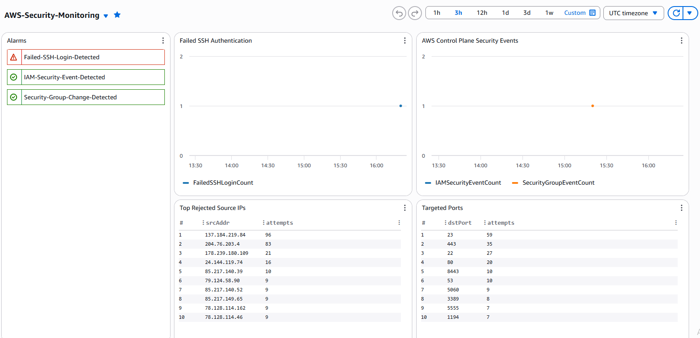
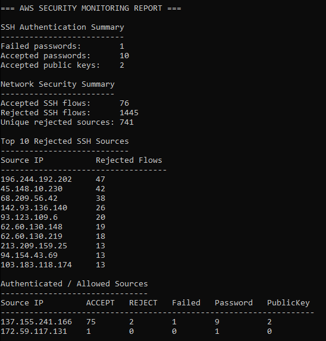

# AWS Cloud Security Monitoring

A hands-on AWS security monitoring project built to collect, detect, and investigate activity across cloud, host, and network layers.

The environment combines AWS CloudTrail, CloudWatch, VPC Flow Logs, EC2 telemetry, and a Python/Boto3 analyzer to provide centralized security visibility and detection capabilities.

**Live Project:** https://monitoring.eyoungcyber.com

## Security Dashboard



The CloudWatch dashboard provides a central view of:

- Security alarm status
- Failed SSH authentication
- AWS control-plane security events
- Rejected source IPs
- Targeted network ports

## Architecture

The monitoring environment collects telemetry from three main sources:

- **AWS CloudTrail** — records AWS API and control-plane activity
- **CloudWatch Agent** — collects Linux authentication and system logs from EC2
- **VPC Flow Logs** — provides visibility into accepted and rejected network traffic

The collected data is sent to CloudWatch, where metric filters, alarms, dashboards, and Logs Insights are used for detection and investigation.

```text
CloudTrail ─────────────┐
                       │
EC2 Authentication ────┼──> CloudWatch ──> Metrics / Alarms ──> Dashboard
                       │                         │
VPC Flow Logs ─────────┘                         └──> Investigation / Python Analysis
```

## Security Detections

Current detections include:

- IAM security-related changes
- Security group changes
- Failed SSH authentication attempts

CloudWatch metric filters convert matching log events into security metrics. CloudWatch alarms provide a visible alert when detection thresholds are reached.

## Host Monitoring

A dedicated Ubuntu EC2 instance is monitored using the CloudWatch Agent.

Authentication and system logs are collected in CloudWatch, allowing SSH activity on the host to be reviewed alongside AWS and network telemetry.

## Network Monitoring

VPC Flow Logs capture traffic across the VPC and provide visibility into:

- Accepted connections
- Rejected connections
- SSH traffic
- Frequently observed source addresses
- Commonly targeted ports

This allows activity recorded by the operating system to be compared with traffic observed at the AWS network layer.

## Python Security Analyzer

`scripts/security_analyzer.py` uses Python and Boto3 to query collected telemetry and generate a security report.

The analyzer:

- Collects SSH authentication events from CloudWatch
- Queries VPC Flow Logs for SSH traffic
- Separates accepted and rejected connections
- Counts successful and failed authentication activity
- Identifies high-volume rejected source addresses
- Correlates authenticated sources with network activity
- Generates a timestamped report for investigation



## End-to-End Validation

The monitoring pipeline was tested using a controlled authentication event.

```text
Test Event
    ↓
Linux auth.log
    ↓
CloudWatch Agent
    ↓
CloudWatch Logs
    ↓
Metric Filter
    ↓
CloudWatch Alarm
    ↓
Security Dashboard
    ↓
Python Analyzer
```

The test successfully appeared in the EC2 authentication log, reached CloudWatch Logs, matched the failed-authentication metric filter, triggered the CloudWatch alarm, appeared on the dashboard, and was included in the analyzer output.

This verified the complete collection and detection path rather than testing each component only in isolation.

## Example Analysis

During the validated analysis window, the analyzer reported:

- **1** failed password event
- **10** accepted password events
- **2** accepted public-key events
- **76** accepted SSH flows
- **1,445** rejected SSH flows
- **741** unique rejected source addresses

These results show the difference between authentication activity recorded on the host and the larger amount of connection activity visible at the network layer.

## Repository Structure

```text
aws-cloud-security-monitoring/
├── examples/
│   └── security-report.txt
├── images/
│   ├── monitoring-dashboard.png
│   └── report.png
├── scripts/
│   └── security_analyzer.py
├── site/
│   └── index.html
└── README.md
```

## Technologies Used

- AWS EC2
- AWS CloudTrail
- Amazon CloudWatch
- VPC Flow Logs
- CloudWatch Agent
- CloudWatch Logs Insights
- Python
- Boto3
- Linux
- Nginx

## Project Status

The monitoring environment is operational and has been validated end-to-end.

Current capabilities include centralized AWS, host, and network telemetry; CloudWatch-based detections and alarms; dashboard visualization; VPC traffic analysis; and automated investigation using Python/Boto3.
